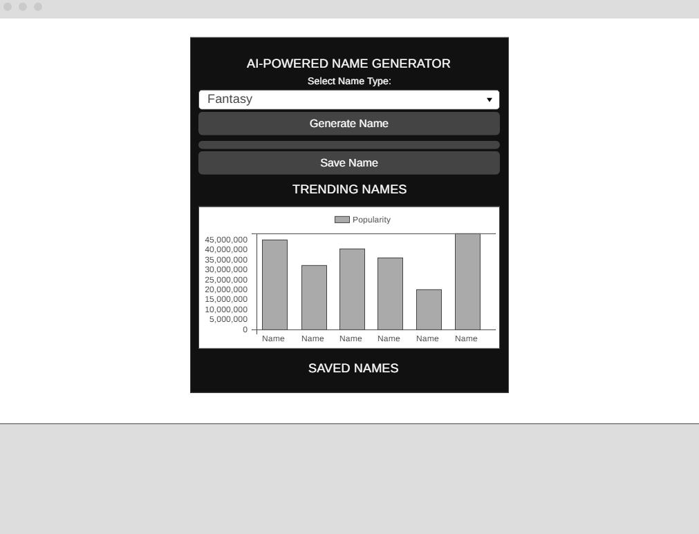
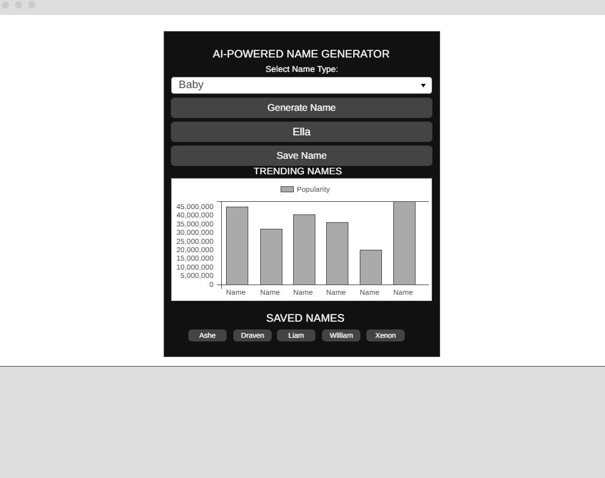

# AI-Powered Name Generator

## Project Overview
The **AI-Powered Name Generator** is a dynamic front-end web application that generates unique names based on different categories such as **Fantasy, Baby, Sci-Fi, and Mystical**. Users can generate a name, save their favorites, and view trending names through a **real-time popularity chart**.

This project demonstrates **interactive functionality** using **JavaScript, HTML, and CSS**, with external support from **Chart.js** for data visualization.

## Features
- **Generate Unique Names:** Users can select a name type and generate a random name.
- **Save Favorite Names:** Users can save names to a list for later reference.
- **Trending Names Chart:** A real-time chart displays the most popular generated names.
- **Interactive UI:** The application has a clean, user-friendly interface with responsive design.

## Technologies Used
- **HTML5** – Structuring the web page
- **CSS3** – Styling and layout design
- **JavaScript (ES6)** – Handling interactions and data logic
- **Chart.js** – External library for rendering the popularity chart

## Project Structure
```
├── index.html      # Main HTML file
├── styles.css      # CSS styling
├── script.js       # JavaScript logic for interactivity
├── README.md       # Project documentation (this file)
```

## How It Works
1. **User selects a name type** from the dropdown list.
2. **Clicks the 'Generate Name' button** to receive a randomly selected name.
3. **The name appears on the screen** and can be saved by clicking the 'Save Name' button.
4. **Trending names are updated dynamically** and visualized in a bar chart.

## Wireframes
### Initial State


### After Interaction


## Setup Instructions
1. Clone this repository:
   ```sh
   git clone https://github.com/Takedown-code/Project-2-Name-Generator-Code-Institute.git
   ```
2. Navigate to the project directory:
   ```sh
   cd Project-2-Name-Generator-Code-Institute
   ```
3. Open `index.html` in your web browser to start using the app.

## Deployment
This project is deployed on **GitHub Pages**. You can access it here:
[Live Demo](https://Takedown-code.github.io/Project-2-Name-Generator-Code-Institute/)

## External Code Attribution
This project uses **Chart.js** for rendering the trending names chart:
- **Library:** [Chart.js](https://www.chartjs.org/)
- **Usage:** Used to dynamically visualize name popularity trends.
- **Attribution:** A comment is included in `index.html` above the Chart.js script tag.

All other code (JavaScript logic, HTML structure, and CSS styling) has been written from scratch by the project author.

Additionally, **ChatGPT-4o** was used for **problem-solving, structuring, and refining** various aspects of this project. The author also used **ChatGPT-4o** to ask for general improvements to enhance the project.
